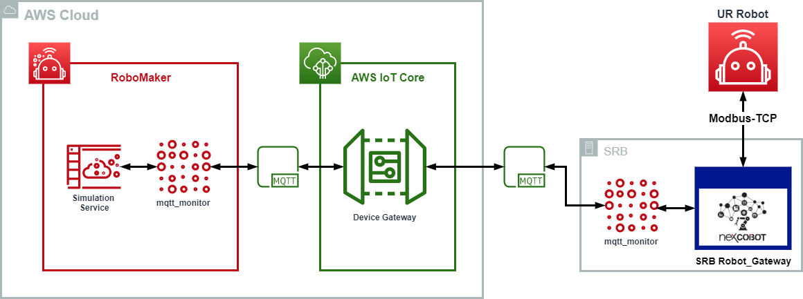

# mqtt_monitor
A ROS package for NexCOBOT Smart Robot Box (SRB) to send the robot arm information to AWS cloud through mqtt.

## Dependence
* NexCOBOT SRB robot_gateway
* [AWS IoT Bridge](https://github.com/aws-robotics/aws-iot-bridge-example) (Cloud extension for ROS)
* [mqtt_bridge](https://github.com/RobinCPC/mqtt_bridge) (note:I made some modified in my fork)

## Build
### Prebuild
``` bash
sudo apt-get update
rosdep update
```

### Clone dependent package
```bash
# Go to your workspace src
cd ~/caktin_ws/src
# Clone AWS_IoT_Bridge and mqtt_bridge
git clone https://github.com/aws-robotics/aws-iot-bridge-example
git clone https://github.com/RobinCPC/mqtt_bridge
# Clone this repository
git clone https://github.com/RobinCPC/mqtt_monitor
```

For used in AWS RoboMaker, please clone robomaker branch
``` bas
# Clone this repository in robomaker branch
git clone https://github.com/RobinCPC/mqtt_monitor -b robomaker
```

### catkin build/make
``` bash
# Back to workspace and run rosdep, then build
cd ~/catkin_ws
rosdep install --from-paths src --ignore-src -r -y
catkin build
```

## Run
### Start UR robot and NexCOBOT SRB robot_gateway
In terminal, use bash as root (because modbus connection use port 502 which need root permission)
``` bash
sudo bash
roslaunch robot_gateway SRB.launch
```

Open new terminal, connect robot gateway with UR robot
``` bash
rosservice call /TrfConnectInfo "vender: 'UR' ip: '192.168.0.200' port: 1"  # note: the ip will need to find from UR controller
```

### Start mqtt_ur_monitor
``` bash
roslaunch mqtt_monitor mqtt_ur_monitor.launch
```

## Architecture


